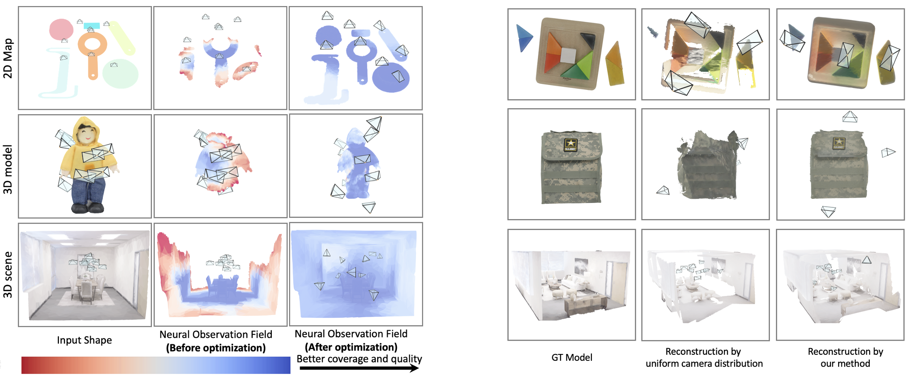
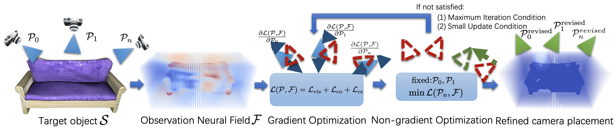

# Neural Observation Field Guided Hybrid Optimization of Camera Placement

This work is based on our paper [NeOF Guided Hybrid Opt. of Camera Placement](https://ieeexplore.ieee.org/document/10638696). we present a hybrid camera placement optimization approach that incorporates both gradient-based and non-gradient-based optimization methods guided by a neural observation field. Our work is implemented in PyTorch.

**Author:** Yihan Cao, Jiazhao Zhang, Zhinan Yu, and Kai Xu

**Affiliation:** National University of Defense Technology

  

## Hybrid Camera Placement Optimization Framework

Camera placement is crutial in multi-camera systems such as virtual reality, autonomous driving, and high-quality reconstruction. The camera placement challenge lies in the nonlinear nature of high-dimensional parameters and the unavailability of gradients for target functions like coverage and visibility. Consequently, most existing methods tackle this challenge by leveraging non-gradient-based optimization methods. In this work, we present a hybrid camera placement optimization approach that incorporates both gradient-based and non-gradient-based optimization methods. This design allows our method to enjoy the advantages of smooth optimization convergence and robustness from gradient-based and non-gradient-based optimization, respectively. To bridge the two disparate optimization methods, we propose a neural observation field, which implicitly encodes the coverage and observation quality. The neural observation field provides the measurements of the camera observations and corresponding gradients without the assumption of target scenes, making our method applicable to diverse scenarios, including 2D planar shapes, 3D objects, and room-scale 3D scenes. Extensive experiments on diverse datasets demonstrate that our method achieves state-of-the-art performance, while requiring only a fraction (8x less) of the typical computation time. Furthermore, we conducted a real-world experiment using a custom-built capture system, confirming the resilience of our approach to real-world environmental noise.




## Installation

The code has been tested only with Python 3.8 on Ubuntu 22.04.


- Install [pytorch](https://pytorch.org/) according to your system configuration. The code is tested on pytorch v2.2.0 and cudatoolkit v11.8. If you are using conda:
```
# CUDA 11.8
conda install pytorch==2.2.0 torchvision==0.17.0 torchaudio==2.2.0 pytorch-cuda=11.8 -c pytorch -c nvidia
# CPU Only
conda install pytorch==2.2.0 torchvision==0.17.0 torchaudio==2.2.0 cpuonly -c pytorch
```
## Setup
Clone the repository and install other requirements:
```
git clone https://github.com/yhanCao/NeOF-HybridCamOpt.git
cd NeOF-HybridCamOpt/
pip install -r requirements.txt
```


## Datasets  
We provide examples of 2D, 3D_model and real-world scanning objects in data/ folder. You can also download objects or scenes from other datasets.  
For 2D models, download the [ABC dataset](https://deep-geometry.github.io/abc-dataset/).  
For 3D models, download the [GSO dataset](https://huggingface.co/datasets/SEU-WYL/GSO-SAD/tree/main).  
For 3D scenes, download the [Replica dataset](https://github.com/facebookresearch/Replica-Dataset).


### For optimization: 
For optimization the camera layer:
```
python main.py --path random/brother/ --height 0.8 --cameranum 10 \
--epoches 20 --iterations 20 \
--isscene False --modelname data/3D_model/1Brother/visual_geometry.obj 
```


## Demo Video

<video src='img/model.mp4' autoplay></video>  
<video src='img/scene.mp4' autoplay></video>

## Citation
```
@article{cao2024neural,
  title={Neural Observation Field Guided Hybrid Optimization of Camera Placement},
  author={Cao, Yihan and Zhang, Jiazhao and Yu, Zhinan and Xu, Kai},
  journal={IEEE Robotics and Automation Letters},
  year={2024},
  publisher={IEEE}
}
```